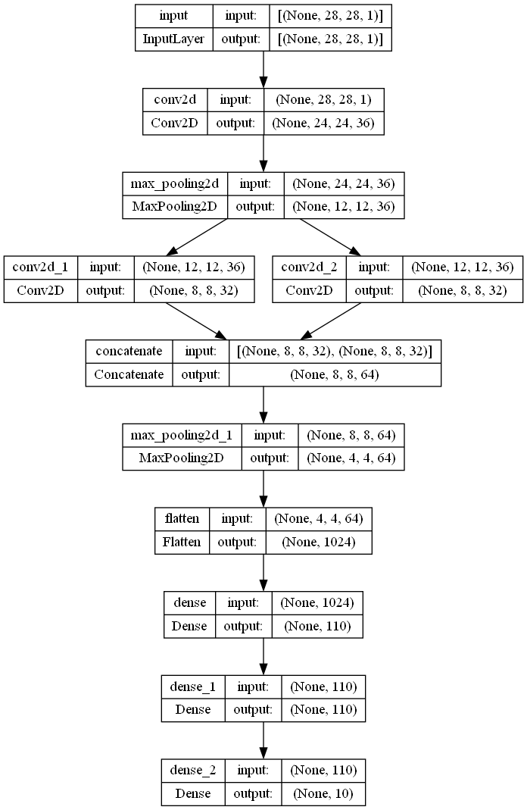

# keras_2_torch
最近在做实验，发现很多优秀的论文，他们都用pytorch实现了自己的算法，
但由于某些原因，我必须使用keras进行模型的生成，因此需要将已经生成的H5模型转化为pt模型。

目前网上有一些资料，但是对于H5转pt的描述很模糊，并且运行结果差强人意，只能应对一些比较简单的线性模型。

# Contribution
本项目用于解决Keras的H5模型与Pytorch的pt模型之间转换的实际需求。

采用手动的方法实现一个复杂模型的H5到pt格式转换，分享在模型转化过程中Debug的经验，以及以一个实际案例，讲解两个框架之间的不同。

- [x] 实现一个简单的转换案例
- [ ] 诠释两种构建之间的不同
- [ ] 分享Debug经验、方法

# Example
original_models下有一个非常复杂的模型：

具有多输入、多输出、卷积层、全连接层、flatten层、池化层、concatenate层，
基本涵盖了一个普通keras模型有的全部结构了。

认真学习模型结构的定义以及模型权重之间的转换能够帮助我们更进一步了解两个框架之间的差别